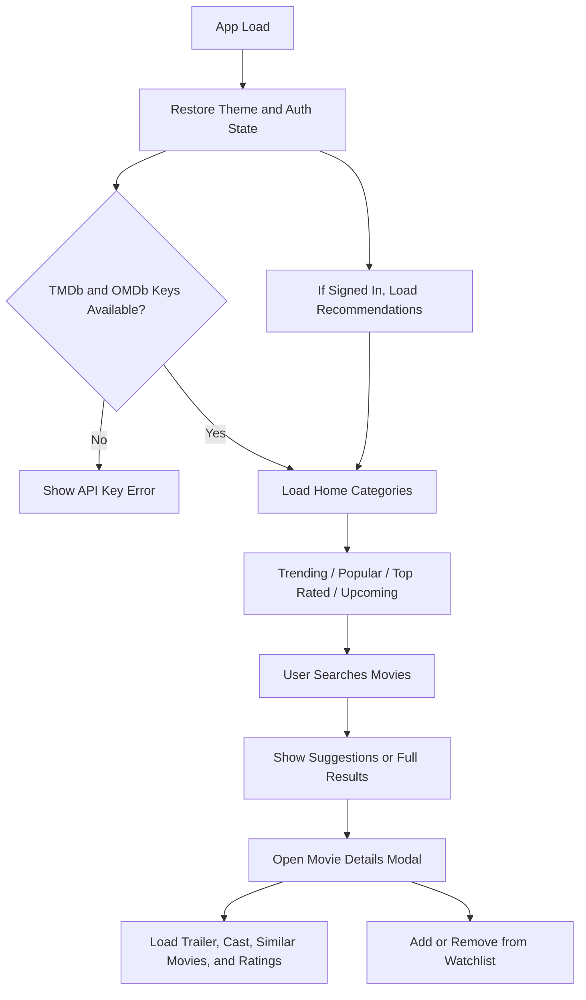

# MovieWatcher
   
MovieWatcher is a modern movie discovery app built with Vite. It uses the TMDb and OMDb APIs to deliver trending, popular, top-rated, and upcoming movies, plus search, detailed movie views, trailers, similar titles, and a personalized watchlist experience.

## Overview

MovieWatcher is designed to feel fast and simple:

1. The app loads and restores the saved theme and sign-in state.
2. Movie categories are fetched from TMDb and rendered on the home screen.
3. Search suggestions appear as the user types.
4. Clicking a movie opens a rich details modal with cast, trailer, ratings, and similar movies.
5. Signed-in users can save favorites, manage a watchlist, and personalize recommendations through profile preferences.

## Workflow



## File Structure

```text
index.html
package.json
style.css
src/
  api.js
  auth.js
  favorites.js
  main.js
  ui.js
```

## File Roles

- `index.html` is the app shell and contains the main layout, modals, search bar, and Vite entry point.
- `style.css` controls the full visual design and responsive layout.
- `src/main.js` is the application controller. It initializes the app, registers listeners, loads categories, handles search, and coordinates auth, watchlist, and profile flows.
- `src/api.js` handles TMDb and OMDb requests. It also contains the recommendation logic.
- `src/ui.js` handles DOM rendering for cards, rows, suggestions, modals, spinners, and error states.
- `src/auth.js` provides a localStorage-based demo authentication system.
- `src/favorites.js` stores and toggles each user's watchlist in localStorage.

## How It Works

### 1. App Initialization
When the app starts, `src/main.js` wires up modal controls, search, favorites, theme switching, authentication, and profile listeners. It also restores the saved theme and updates the UI based on the current user session.

### 2. Home Feed Loading
`loadAllCategories()` fetches trending, popular, top-rated, and upcoming movies in parallel. If the user has a saved profile, the app also loads personalized recommendations and places them at the top of the feed.

### 3. Search Experience
Search is debounced so the app stays responsive while typing. The user can browse live suggestions or run a full search to see a dedicated results view.

### 4. Movie Details Modal
Selecting a movie opens a modal with the full experience:

- TMDb metadata and overview
- Cast list
- Trailer embed
- Similar movies
- IMDb rating from OMDb
- Add or remove from watchlist

### 5. Authentication and Profile
The app uses a demo sign-in and sign-up flow backed by localStorage. Once signed in, the user can open the profile modal, save genre and interest preferences, and receive more relevant recommendations.

## Data Flow

```text
User Action -> main.js -> api.js / auth.js / favorites.js -> ui.js -> DOM Update
```

## Setup

### Requirements

- Node.js
- npm
- TMDb API key
- OMDb API key

### Install Dependencies

```bash
npm install
```

### Environment Variables

Create a `.env` file in the project root and add:

```env
VITE_TMDB_API_KEY=your_tmdb_key_here
VITE_OMDB_API_KEY=your_omdb_key_here
```

### Run Locally

```bash
npm run dev
```

### Build for Production

```bash
npm run build
```

### Preview the Production Build

```bash
npm run preview
```

## Key Features

- Trending, popular, top-rated, and upcoming movie rows
- Live search suggestions
- Full search results page
- Movie details modal with cast, trailer, similar movies, and ratings
- Light and dark theme toggle
- Sign in and sign up UI
- Personalized recommendations based on saved preferences
- User-specific watchlist stored in localStorage

## Notes

- The authentication system is demo-only and uses localStorage.
- Recommendations are generated through TMDb's discover API.
- If API keys are missing, the app shows an error message on startup.

## Demo

If you want, you can add a screenshot, GIF, or live deployment link here before publishing the repository.


